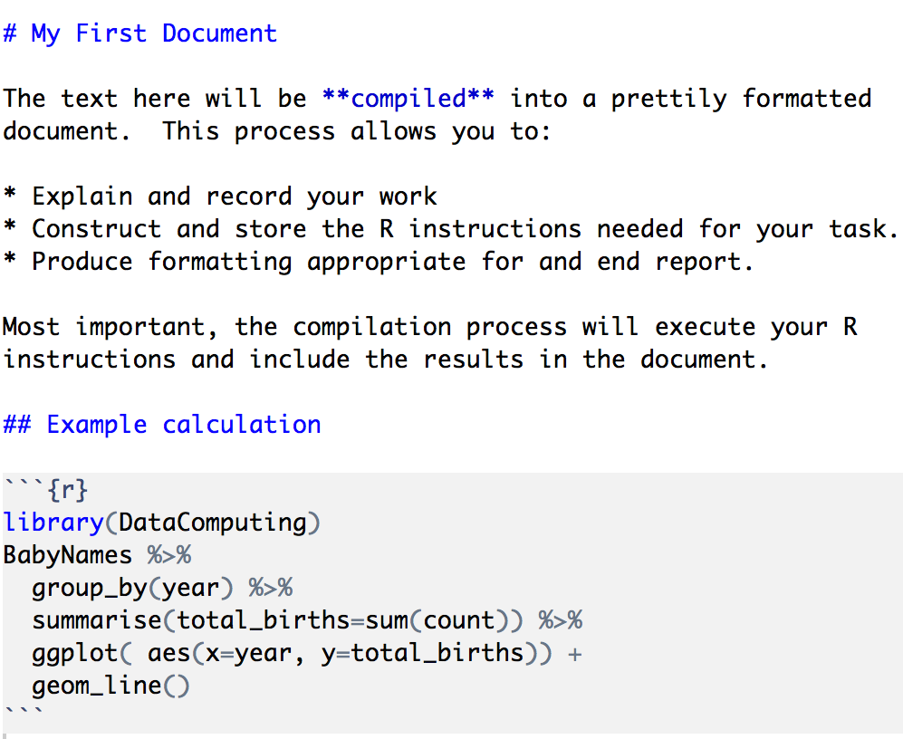
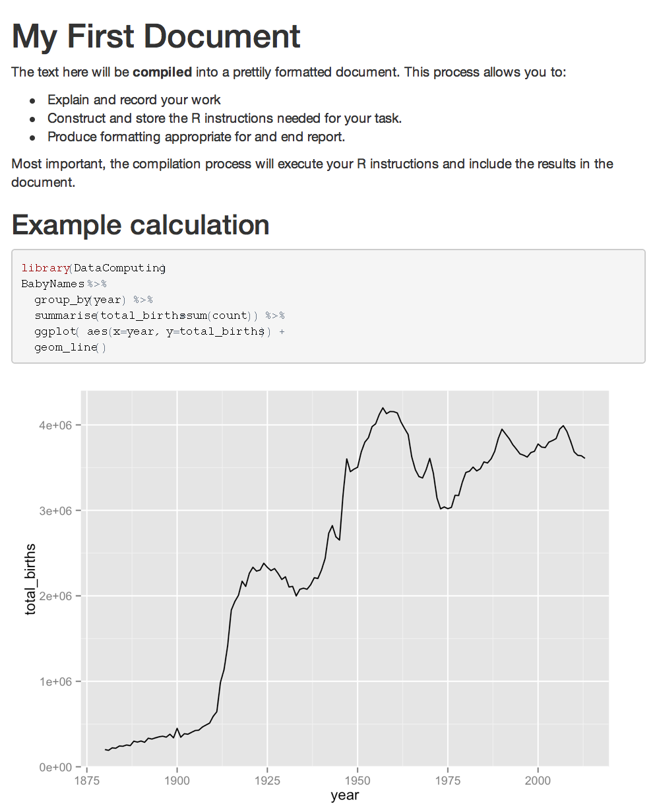

# Documents with R/Markdown {-}

The purpose of data wrangling and visualization is communication: condensing and presenting data in a form that conveys information.  An important part of communication is documentation and reporting.\index{wrangle}\index{visualization, see graphics}

\index{Rmd file!writing}

Writing is not a linear process.  Ideas are presented, revised or abandoned, corrected, re-focussed, and re-arranged.  Data-oriented technical reports tie together narrative, graphics and summary tables and are based on potentially complex computer commands.  There is an interplay between the computer commands and the narrative.  Results from the computer may drive reconsideration of the narrative. Gaps in the narrative may point to shortcomings or omissions in the computer commands. And, always, there is the possibility of errors in writing commands and the need to document commands so that they can be checked and corrected. As well, data are commonly updated, corrected or extended.  

The familiar practice of cutting and pasting from the computer console into a word processor does not address these features of technical reports.  Cutting and pasting makes it hard to revise or update a report; you've got to cut out the old and paste in the new, figuring out for yourself which is which. This introduces the likelihood of error. And, there's nothing to document the linkages between the computer commands and the word-processed document.

An important concept in data-driven reporting is "reproducibility." \index{reproducible reports} The idea is to be able to reproduce your entire document without any manual intervention, and, more important, to be easily able to generate a new report in response to changes in data or revisions in computer commands. In other words, reproducible reports contain all the information needed to generate a new report.  Common document formats such as `.pdf`, `.docx`, or `.html` do not offer support for reproducibility.

In R, reproducible reporting is provided by the `.Rmd` file format and related software.  An `.Rmd` file integrates computer commands into the narrative so that, for instance, graphics are produced by the commands rather than being inserted from another source.

`r tufte::newthought("You create and modify reproducible reports")` within RStudio's text editor.  The `.Rmd` file you create contains only ordinary text and punctuation: no formatting, color, images, etc.  Instead, the ordinary-text contents of the `.Rmd` describe both what you want the eventual format to look like and what R commands you want the computer to carry out in generating the report.

Figure \@ref(fig:rmd-compile) shows a simple `.Rmd` document, something you might write in the RStudio editor.   The figure also shows the `.html` file that is the result of compiling the `.Rmd`.\index{compile!Rmd to HTML}\index{HTML!compiled from Rmd}\index{Rmd!compile to HTML}


```{r rmd-compile, echo = FALSE, fig.cap = "An `.Rmd` file consists of text."}

```

*Knitting* is the process of translating or "compiling" the `.Rmd` file into a nicely typeset document including the output of the computations written in the `.Rmd` file. The result of knitting is often an `.html` file suitable for sharing on the internet, but other output formats such as PDF or e-pub can also be used. Figure \@ref(fig:rmd-compiled) shows the result of compiling the `.Rmd` file displayed in Figure \@ref(fig:rmd-compile).

```{r rmd-compiled, echo = FALSE, fig.cap = "The `.html` document that results from knitting the `.Rmd` file."}

```

## The Write/Compile Cycle

\index{write/compile cycle}\index{reader-friendly document}

After you edit an `.Rmd` file, you \vocabDefinition{compile}{The process of a computer translating a file from one format to another.} the report into a reader-friendly document format such as `.pdf`, `.docx`, or `.html` that can easily be printed or displayed on the report-reader's computer.  You never edit the reader-friendly document; it's created automatically from your `.Rmd` instructions. When you want to update or modify or correct the end report, you edit the `.Rmd` file.

It's a good strategy to compile your `.Rmd` frequently.  Start with a small, simple document.  Then add a bit more to it: one paragraph or one "chunk" (see below).  Compile again. If something goes wrong, you will have a good idea of where the problem lies. Go back and fix things.  Make small changes, compile, see if it worked. Repeat. Figure \@ref(fig:edit-cycle) shows several steps in such an editing cycle.  

It's impossible to avoid errors; even professionals make them. Instead, adopt a process that let's you identify errors quickly so that you can fix them before moving on. The shorter the write/compile cycle, the easier it will be to know when you have erred.

`r tufte::margin_note("Interactive commands such as")` `file.choose()` or `scatterGraphHelper()` cannot be used in an an `.Rmd` file; there's no opportunity for interaction in the compilation process.  Instead, use the interactive command in the console, get the result, and paste that result into your `.Rmd` file.  \index{Rmd!no interactive functions}\index{interactive functions!not in \texttt{.Rmd}}

## Command "Chunks"

The R commands in an `.Rmd` file go into "chunks", a range of lines in the documents that are delimited in a special way so that they will be executed as part of the `.Rmd` $\rightarrow$ `.html` compilation process.^[Exactly the same applies when compiling to `.pdf` of `.docx`.] The opening delimiter is   
     `r ''` ```{r}
     
The closing delimiter is simply      
     `r ''````

Each of these delimiters goes on its own line.^[Both the opening and closing delimiters for a chunk include "back-quotes," a quote character that goes from upper-left to bottom-right. On many keyboards, back-quote is on the same key as tilde (~), like this: `r knitr::include_graphics("Images/backquote-key.jpg", dpi = 400)`
]

`r tufte::newthought('Most .Rmd files will draw on a library')` that needs to be loaded into the R session.  When you compile `.Rmd` $\rightarrow$ `.html`, R starts a brand new session that is, initially, empty and with no libraries loaded.  When the compilation is complete, that session evaporates, leaving as its only residue the `.html` result.

\index{argument!chunk in Rmd}\index{chunk!argument}\index{Rmd!chunk}
Often, the first chunk in your document will be an instruction to load one or more libraries.  Since this will be in just about every `.Rmd` document, it can be called the \vocabDefinition{boilerplate}{A standardized piece of text intended for re-use in many documents.} chunk. It looks like this:
A boilerplate chunk goes at the start of the document. It loads the libraries that the following commands will use.
```{r echo = FALSE, comment = ''}
# cat(ISMmd::verbatim_input("Images/chunk-example-2.txt"))
```

The `include=FALSE` chunk argument helps to prettify the document: it is an instruction not to show the contents of the chunk in the output file. \index{include@\texttt{include=FALSE} argument in Rmd}


Start with a short and simple document, like this:
```{r echo = FALSE, comment = ""}
cat(ISMmd::verbatim_input("Images/salt-peter-1.Rmd"))
```

OR IN ANOTHER FORMAT
```
# Saltpeter Logistics

by Abigail Adams

This report compares production of saltpeter 
with the "French method" to the "Swiss method."
```
```{r echo = FALSE, figuremargin = TRUE}
knitr::include_graphics("Images/salt-peter-html-1.png", dpi = 300)
```

We have no bananas today. | We've got all sorts of other fruits.

First pass | Second pass | Third pass
-----------|-------------|----------
`r knitr::include_graphics("Images/salt-peter-html-1.png", dpi = 300)` |`r knitr::include_graphics("Images/salt-peter-html-2.png", dpi = 300)` | `r knitr::include_graphics("Images/salt-peter-html-3.png", dpi = 300)`

\begin{tabular}{c|c|c}\\
\parbox[t]{1.75in}{\raggedright {\bf Step 1}. Start with a short and simple document.} & 
\parbox[t]{1.75in}{\raggedright {\bf Step 2}. Add the boilerplace chunk and a chunk to your start your wrangling. Test that it works. If not, go back and fix it.\rule[-2pt]{0pt}{5pt}} & 
\parbox[t]{1.75in}{\raggedright {\bf Step 3}. Add more to the wrangling chunk. Test that it works.}\\\hline
\parbox[t]{2in}{\VerbatimInput{Images/salt-peter-1.Rmd}} & \parbox[t]{2in}{\VerbatimInput{Images/salt-peter-2.Rmd}} & \parbox[t]{2in}{\VerbatimInput{Images/salt-peter-3.Rmd}}\\
Compile to HTML & Compile to HTML & Compile to HTML\\
\includegraphics[width=1.75in]{Images/salt-peter-html-1.png} &
\includegraphics[width=1.75in]{Images/salt-peter-html-2.png} &
\includegraphics[width=1.75in]{Images/salt-peter-html-3.png} \\
\end{tabular}

\captionof{figure}{\label{fig:edit-cycle} Three steps in the write/compile cycle. At each step, the \texttt{.Rmd} file (shown in \texttt{monospace font}) is compiled into the \texttt{.html} format shown underneath.}


`r tufte::newthought("Distributing the .Rmd file is helpful")` when communicating with a technically savvy audience.  A nice strategy for getting the benefits of both the easily-readable `.html` format and the original `.Rmd` file is to include the `.Rmd` file *inside* the `.html`, much as you might attach a file to an email message. The `DataComputing` package provides a way to do this easily`r tufte::margin_note("The document template 'Data Computing simple' includes the source document by default.")` by including the following chunk in the `.Rmd` file. \index{HTML!include Rmd file}\index{Rmd!include in HTML file}\index{compiler!Rmd to HTML}\index{includeSourceDocument@\texttt{includeSourceDocuments}}

```{r echo = FALSE, comment = ''}
cat(ISMmd::verbatim_input("Images/includeSourceDocuments.Rmd"))
```


This chunk will embed the source file into your `.html`. The originating `.Rmd` file can be extracted by clicking on a link that is contained within the `.html` file.