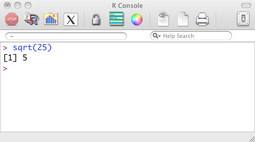
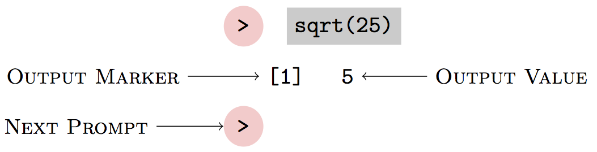

# Introduction {#introduction}

```{r include = FALSE}
library(detex)
detex_index_entry <- function(...) {NULL}
```


Modern statistics is done on the computer.  There was a time, 60 years
ago and before, when computation could only be done by hand or using
balky mechanical calculators.  The methods of applied statistics
developed during this time reflected what could be done using such
calculators, not necessarily what was best for illuminating the
system under study.  These methods took on a life of their own ---
they became the operational definition of statistics.  They continue
to be taught today, using electronic calculators or personal
computers or even just using paper and pencil.  For the old
statistical methods, computers are merely a labor saving device.

But not for modern statistics.  The statistical methods at the core of
this book cannot be applied in a authentic and realistic way without
powerful computers.  Thirty years ago, many of the methods 
could not be done at all
unless you had access to the resources of a government agency or a
large university.  But with the revolutionary advances in computer
hardware and numerical algorithms over the last half-century, modern
statistical calculations can be performed on an ordinary home computer
or laptop. (Even a cell phone has phenomenal computational power,
often besting the mainframes of thirty years ago.)
Hardware and software today pose no limitation; they are readily
available.  

`r detex_index_entry('C', 'computation!foundations')`
Each chapter of this book includes a section on computational
technique.  Many readers will be completely new to the use of
computers for scientific and statistial work, so the first chapters
cover the foundations, techniques that are useful for many different
aspects of computation.  Working through the early chapters is essential
for developing the skills that will be used later in actual
statistical work.  It will take a few hours, but this investment will
pay off handsomely.

Chances are, you use a computer almost every day: for email,
word-processing, managing your music or your photograph collection, 
perhaps even using a spreadsheet program for accounting. The software
you use for such activities makes it easy to get started.  Possibly
you have never even looked at an instruction manual or used the "help"
features on your computer. 

When you use a word processor or email, the bulk of what you enter
into the computer --- the content of your documents and email --- is
without meaning to the computer.  This is not at all to say that it is
meaningless.  Your documents and letters are intended for human
readers; most of the work you do is directed so that the recipients
can understand them.  But the computer doesn't need to understand what
you write in order to format it, print it, or transmit it over the
Internet.  

When doing scientific and statistical computing, things are different.
What you enter into the computer is instructions to the computer to
perform calculations and re-arrangements of data.  Those instructions
have to be comprehensible to the computer.  If they make no sense or
if they are inconsistent or ill formed, the computer won't be able to
carry out your instructions.  Worse, if the instructions make sense in
some formal way but don't convey your actual intentions, the computer
will perform some operation but the result will mislead you.

The difficulty with using software for mathematics and statistics is
in making sure that your instructions make sense and do what you want
them to do.  This difficulty is not a matter of bad software design;
it's intrinsic to the problem of communicating your intentions to the
computer.  The same difficulty would arise in word processing if the
computer had to make sense of your writing, rejecting it when a claim
is unconvincing or when a sentence is ambiguous. Statistical computing
pioneer John Chambers 
refers to the "Prime Directive" of
software [@chambers-2008]: "to program in such a way that
computations can be understood and trusted."
`r detex_index_entry('C', 'Chambers, John')` 
`r detex_index_entry('C', 'software!prime directive')`

Much of the design of software for scientific and statistical work is
oriented around the difficulty of communicating intentions.  A popular
approach is based on the computer mouse: the program provides a list
of possible operations --- like the keys on a calculator --- and lets
the user choose which operation to apply to some selected data.  This
style of user interface is employed, for example, in spreadsheet
software, letting users add up columns of numbers, make graphs, etc.
The reason this style is popular is that it can make things extremely
easy ... so long as the operation that you want has been included in
the software.  But things get very hard if you need to construct your
own operation and it can be difficult to understand or trust the
operations performed by others.

Another style of scientific computation --- the one used in this
book --- is based on language.  Rather than selecting an option with a
mouse, you construct a `r new_word('command')` that conveys both the
operation that you want and the data to which you want to apply that
operation.  There are dramatic advantages to this language-based
style of computation:

<!-- begin itemize -->

#. It lets you connect computations to one another, so that the
output of one operation can become the input to another.
#. It lets you **repeat** the operation on new or modified data,
allowing you to automate tedious tasks and, importantly, to verify
the correctness of your computations on data where you already know
the answer.
#. It lets you **accumulate** the results of previous operations,
treating those results as new data.
#. It lets you **document** concisely what was done so that you can
demonstrate that what you said you did is what you actually did. 
In this way, you or others can repeat the analysis 
later if necessary to confirm your results.
#. It lets you **modify** the computation in a controlled way
to correct it or to vary some aspect of it while holding other
aspects exactly the same as in the original.
<!-- end itemize -->

In order to use the language-based approach, you will need to learn a
few principles of the language itself: some vocabulary, some syntax,
some grammar.  This is much, much easier for the computer language
than for a natural language like English or Chinese; it will take you
only a couple of hours before you are fluent enough to do useful
computations.  In addition to letting you perform scientific
computations in ways that use the computer and your own time and
effort effectively, the principles that you will learn are broadly
applicable to many computer systems and can provide significant
insight even to how to use mouse-based interfaces.

## The Choice of Software

The software package used in this book is called R.  The R
package provides an environment for doing statistical and scientific
computation at a professional level. It was designed for statistics
work, but suitable for other forms of scientific calculations and the
creation of high-quality scientific graphics.\cite{R-software}

There are several other major software packages widely used in statistics.
Among the leaders are SPSS, SAS, and Stata.  Each of them provides
the computational power needed for statistical modeling.
Each has its own advantages and its own devoted group of users. 
\index{C}{SPSS} \index{C}{SAS} \index{C}{Stata}

One reason for the choice of R is that it offers a command-based
computing environment.  That makes it much easier to write about
computing and also reveals better the structure of the computing
process. [@kaplan-tise-2007]  R is available for free and works on the
major types of computers, e.g., Windows, Macintosh, and
Unix/Linux. The RStudio software lets you work with a complete R
system using an ordinary web browser or on your own computer.  

In making your own choice, the most important thing is this: *choose something*!    Readers who are familiar with SPSS, SAS, or STATA can
use the information in each chapter's computational technique section
to help them identify the facilities to look for in those packages.

`r detex_index_entry("C", 'Google spreadsheets')`
`r detex_index_entry("C", 'spreadsheets')` 
Another form of software that's often used with data
is the spreadsheet.  Examples are Excel `r detex_index_entry('C', 'Excel')` and Google Spreadsheets. Spreadsheets are effective for entering data and have nice facilities for formatting
tables.  The visual layout of the data seems to be intuitive to many people.  Many businesses use spreadsheets and they are widely taught in high schools.  Unfortunately, they are very difficult to use for statistical analyses of any sophistication.
Indeed, even some very elementary statistical tasks 
such as making a histogram are difficult with spreadsheets
and the results are usually unsatisfactory from a
graphical point of view.
Worse, spreadsheets can be very hard to use reliably.  There are lots of
opportunities to make mistakes that will go undetected.
As a result, despite the popularity of spreadsheets, I encourage you to
reserve them for data entry and consider other software for the
analysis of your data.

## The R Command Console

Depending on your circumstances, you may prefer to install R as
software on your own computer, or use a web-based ("cloud
computing") service such as RStudio that runs through a web browser.  
If you are using this book with a course, your instructor may 
have set up a system for you.  If you are on your own, follow the set-up
instructions available on-line at <www.r-project.org>.

Depending on whether you run R on your own computer or in the cloud,
you will start R either by clicking on an icon in the familiar way or
by logging in to the web service.  In either case, you will see a
`r new_word('console panel')` in which you will be typing your commands to
R.  It will look something like Figure \@ref(console-picture).^[DRAFT: Look how out of date this is! No notion of RStudio.  Do note that in the knitr chunk, the chunk label ("console-picture") becomes part of the label for the picture, which can be put in with `\@ref(console-picture)` as in Figure \@ref(console-picture).]

```{r console-picture, echo = FALSE, fig.cap = "The R command console."}

```

The R console gives you great power to carry out statistical and other
mathematical and scientific operations.  To use this power, you need
to learn a little bit about the syntax and meaning of R commands.
Once you have learned this, operations become simple to perform.

## Invoking an Operation

People often think of computers as *doing* things: sending email,
playing music, storing files.  Your job in using a computer is to tell
the computer *what* to do.  There are many different words used 
to refer to the "what": a procedure, a task, a function, a routine,
and so on.  I'll use the word `r new_word('computation')`.  Admittedly, this
is a bit circular, but it is easy to remember: computers perform computations.

Complex computations are built up from simpler computations.  This may seem obvious, but it is a powerful idea.  An `r new_word('algorithm')` is just a description of a 
computation in terms of other computations that you already know how to perform.  To help distinguish between the computation as a whole and the simpler parts, it is helpful to introduce a new word: an `r new_word("operator")` [@R software!operator] performs a computation.

It's helpful to think of the computation carried out by an operator 
as involving four parts:
<!-- begin enumerate -->

#. The name of the operator
#. The input arguments
#. The output value
#. Side effects
<!-- end enumerate -->
A typical operation takes one or more **input arguments** and uses the
information in these to produce an **output value**.  Along the way, the
computer might take some action: display a graph,
store a file, make a sound, etc.  These actions are called
`r new_word('side effects')`.  

To tell the computer to perform a computation --- call this
**invoking an operation** or giving a **command** --- 
you need to provide the
name and the input arguments in a specific format. The computer then
returns the output value.  For example, the command `sqrt(25)`
invokes the square root operator (named `sqrt`) on the argument
25.  The output from the computation will, of course, be 5.

`r detex_index_entry('C', 'syntax!in R')`  
`r detex_index_entry("C", 'R!syntax')`
The syntax for invoking an operation consists of the operator's name,
followed by round parentheses.  The input arguments go inside the
parentheses.

The software program that you use to invoke operators is called an
`r new_word('interpreter')`.  (The interpreter is the program you are
running when you start R.)  You enter your commands as a dialog
between you and the interpreter.  To start, the interpreter prints a
prompt, after which you type your command:


<!-- 
NOTE: There is a bit of tikz in the original. Probably best to pull these from the original PDF file, as I've done above.]
```tikz{r engine = "tikz"}
\begin{tikzpicture}
\node (prompt) at (0,0) [fill=red!20] {\verb+>+};
\node (promptlabel) at (-3,0) {\small\sc Prompt};
\draw [->] (promptlabel.east) -- (prompt.west);
\node (statement) at (1.5,0) [rectangle,fill=black!20] {\verb+sqrt(25)+};
\node (commandlabel) at (4,0) {\small\sc Command};
\draw [->] (commandlabel.west) -- (statement.east);
\end{tikzpicture}
```
-->

When you press "Enter," the interpreter reads your command and performs
the computation.  For commands such as this one, the interpreter
will print the output value from the computation:




<!--
```tikz
\begin{tikzpicture}
\node (prompt) at (0,0) [fill=red!20] {\verb+>+};
\node (statement) at (1.5,0) [rectangle,fill=black!20] {\verb+sqrt(25)+};
\node (output)  at (1,-.75)  {\verb+[1]   5+};
\node (outputlabel) at (4,-.75) {\small\sc Output Value};
\node (outputmarker) at (-2.25, -.75) {\small \sc Output Marker};
\draw [->] (outputmarker.east) -- (output.west);
\draw [->] (outputlabel.west) -- (output.east);
\node (prompt2) at (0, -1.5) [ellipse,fill=red!20] {\verb+>+};
\node (nextlabel) at (-2.5,-1.5) {\small\sc Next Prompt};
\draw [->] (nextlabel.east) -- (prompt2.west);
\end{tikzpicture}
```
-->

The dialog continues as the interpreter prints another prompt and
waits for your further command.

To save space, I'll usually show just the give-and-take from one round
of the dialog:
```{r}
sqrt(25)
```

(Go ahead!  Type `sqrt(25)` after the prompt in the R
interpreter, press ``enter,'' and see what happens.)

Often, operations involve more than one argument.  The various
arguments are separated by commas.  For example, here is an operation
named `seq` 
`r detex_index_entry('P', 'seq')`
that produces a sequence of numbers:
<!--  to color text: TEX COMMAND NOT FOUND textcolor red the text to be colored -->

```{r }
seq(3,10)
```
 

The first argument tells where to start the sequence, the second tells
where to end it.

The order of the arguments is important.  Here is the sequence
produced when 10 is the first argument and 3 the second:
```{r }
seq(10,3)
```
 

For some operators, particularly those that have many input arguments,
some of the arguments can be referred to by name rather than
position. This is particularly useful when the named argument has a
sensible default value.
For example, the `seq` operator can be instructed how big a
jump to take between successive items in the sequence.  This is
accomplished using an argument named `by`:
```{r }
seq(3,10,by=2)
```
 

Depending on the circumstances, all four parts of a
operation need not be present.  For example, the `date`
`r detex_index_entry('P', 'date')` 
operation returns the current time and date; no input arguments are needed.
```{r}
date()
```
Note that even though there are no arguments, the parentheses are 
still used.  Think of the pair of parentheses as meaning, "Do this."


### Naming and Storing Values

Often the value returned by an operation will be used later on.
Values can be stored for later use with 
the `r new_word('assignment operator')` `r detex_index_entry('C','assignment computer value')`.  This has a different syntax that
reminds the user that a value is being stored.  Here's an example of a
simple assignment:
`r detex_index_entry('P', 'R Syntax assignment =')` 
`r detex_index_entry('P', '=')` 
```{r }
x <- 16
```
This command has stored the value 16 under the name `x`.
The syntax is always the same: an equal sign (`=`) with a name
on the left and a value on the right.

Such stored values are called `r new_word('objects')` `r detex_index_entry("C", "objects, in R")`.  Making an assignment
to an object defines the object.  Once an object has been
defined, it can be referred to and used in later computations.

Notice that an assignment operation does not return a value or display
a value.  Its sole purpose is to have the side effects of defining the
object and thereby storing a value under the object's name.

To refer to the value stored in the object, 
just use the object's name itself. For instance:
```{r }
x
``` 
Doing a computation on the value stored in an object is much the same:
<<>>=
sqrt(x)
@ 

You can create as many objects as you like and give them names that remind you 
of their purpose.  Some examples: `wilma`, `ages`, `temp`,
`dog.houses`, `foo3`.  There are some rules for object names:
`r detex_index_entry('C', 'R software!names of objects')` 

<!-- begin itemize -->

#. Use only letters and numbers and the two punctuation marks
  "dot" (`.`) and "underscore" (`_`).
#. Do NOT use spaces anywhere in the name.
#. A number or underscore cannot be the first character in the name.
#. Capital letters are treated as distinct from lower-case letters.
  The objects named `wilma` and `Wilma` are
  different.   
<!-- end itemize -->
For the sake of readability, keep object names short.  But if you really must have an object named something like 
`agesOfChildrenFromTheClinicalTrial`, feel free.

Objects can store all sorts of things, for example a sequence of numbers:
```{r results = "hide"}
x <- seq(1,7)
```
 
When you assign a new value to an existing object, as just done to
`x`, the former value of
that object is erased from the computer memory. The former value of `x` was 16, but after the above assignment command it is 
```{r }
x
```
 

The value of an object is changed only *via* the assignment
operator.  Using an object in a computation does not change the
value.  For example, suppose you invoke the square-root operator on `x`:
```{r }
sqrt(x)
```
 

The square roots have been returned as a value, but this doesn't
change the value of `x`:
```{r }
x
```
 
If you want to change the value of `x`, you need to use the
assignment operator:
```{r }
x <- sqrt(x)
x
```
 
### Assignment vs Algebra

> An assignment command like `x = sqrt(x)` can be confusing to
people who are used to algebraic notation.  In algebra, the equal sign
describes a relationship between the left and right sides.  
So, $x = \sqrt{x}$ tells us about how the quantity $x$ and the
quantity $\sqrt{x}$ are related.  Students are usually trained to
"solve" such relationships, going through a series of algebraic 
steps to find values for $x$ that are
consistent with the mathematical statement.  (For $x = \sqrt{x}$, the solutions are $x=0$ and $x=1$.)  In contrast, the assignment command 
`x = sqrt(x)` is a way of replacing the previous values stored
in `x` with new values that are the square root of the old
ones.  


### Connecting Computations

`r detex_index_entry('C', 'computation!connecting')` 

The brilliant thing about organizing operators in terms of input
arguments and output values is that the output of one operator can be
used as an input to another.  This lets complicated computations be
built out of simpler ones.

For example, suppose you have a list of 10000
voters in a precinct and you want to select a random sample of 20 of
them for a survey. The `seq` operator can be used to generate
a set of 10000 choices.  The `sample` operator can be used to
select some of these choices at random.


One way to connect the computations is by using objects to store the
intermediate outputs.   
```{r }
choices = seq(1,10000)
sample( choices, 20 )
```
 

You can also pass the output of an operator *directly* as an
argument to another operator.  Here's another way to accomplish
exactly the same thing as the above.
```{r }
sample( seq(1,10000), 20 )
```
 

### Numbers and Arithmetic

`r detex_index_entry('C', 'arithmetic R notation')` 
`r detex_index_entry('C', 'R software arithmetic notation')` 
`r detex_index_entry('P', 'arithmetic')` 
`r detex_index_entry('P', 'R Syntax arithmetic')` 
The language has a concise notation for arithmetic that looks very
much like the traditional one:
```{r }
7+2
3*4
5/2
3-8
-3
5^2
```
 

Arithmetic operators, like any other operators, can be connected to
form more complicated computations.  For instance, 
```{r }
8+4/2
```
 
To a human reader, the command `8+4/2` might seem ambiguous.
Is it intended to be `(8+4)/2` or `8+(4/2)`?  The
computer uses unambiguous rules to interpret the expression, but it's
a good idea for you to use parethesis so that you can make sure that
what you intend is what the computer carries out:
```{r }
(8+4)/2
```
 

Traditional mathematical notation uses superscripts and radicals to
indicate exponentials and roots, e.g., $3^2$ or $\sqrt{3}$ or
$\sqrt[3]{8}$.  This special typography doesn't work well with an
ordinary keyboard, so R and most other computer 
languages uses a different notation:
```{r }
3^2
sqrt(3)
8^(1/3)
```
 

There is a large set of mathematical functions: exponentials, logs,
trigonometric and inverse trigonometric functions, etc.  Some examples:

\index{P}{sqrt@\texttt{sqrt}}
\index{P}{log@\texttt{log}} \index{P}{exp@\texttt{exp}}
\index{P}{trigonometry}
\index{C}{R software!mathematical functions}

Traditional | Computer
------------|-------------
$e^2$ | `exp(2)`
$\log_e(100)$           | `log(100)`
$\log_{10}(100)$        |  `log10(100)`
$\log_{2}(100)$         | `log2(100)`
$\cos( \frac{\pi}{2})$ | `cos(pi/2)`
$\sin( \frac{\pi}{2})$ | `sin(pi/2)`
$\tan( \frac{\pi}{2})$ | `tan(pi/2)`
$\cos^{-1}(-1)$         | `acos(-1)`


`r detex_index_entry('C', 'gravity')` 
Numbers can be written in `r new_word('scientific notation')`.  For example, the
"universal gravitational constant" that describes the gravitational
attraction between masses is $6.67428 \times  10^{-11}$ (with units
meters-cubed per kilogram per second squared).  In the computer
notation, this would be written `G=6.67428e-11`. The Avogradro constant, which gives the number of atoms in a mole, is $6.02214179
\times  10^{23}$ per mole, or `6.02214178e23`.
`r detex_index_entry('C', 'Avogadro constant')` 

The computer language does not directly support the recording of
units.  This is unfortunate, since in the real world numbers often have
units and the units matter.  For example, in 1999 the Mars Climate
Orbiter crashed into Mars because the design engineers specified the
engine's thrust in units of pounds, while the guidance engineers
thought the units were newtons.\index{C}{Mars Climate Orbiter}

\index{C}{arithmetic!accuracy}
\index{C}{rounding}
\index{C}{accuracy!computer arith}
Computer arithmetic is accurate and reliable, but it often
involves very slight rounding of numbers.  Ordinarily, this is not
noticeable.  However, it can become apparent in 
some calculations that produce results that are zero.  For example,
mathematically $\sin(\pi) = 0$, however the computer does not
duplicate this mathematical relationship exactly:
```{r }
sin(pi)
```
 
Whether a number like this is properly interpreted as "close to
zero," depends on the context and, for quantities that have units, on
the units themselves.  For instance, the unit "parsec" is used in
astronomy in reporting distances between stars.  The closest star to
the sun is Proxima, at a distance of 1.3 parsecs.^[News from August 2016: Astronomers have announced that Proxima has a planet orbiting it in the "habitable zone."]
\index{C}{parsec}
\index{C}{Proxima}
A distance of $1.22 \times 10^{-16}$ parsecs is tiny in
astronomy but translates to about 2.5 meters --- not so small on the
human scale.  

In statistics, many calculations relate to probabilities which are
always in the range 0 to 1.  On this scale, `1.22e-16` is very
close to zero. 

\index{C}{infinity!INF on computer}
\index{C}{NAN}
\index{C}{numbers!INF and NaN}

There are two "special" numbers.  `Inf` stands for $\infty$, as in 
```{r }
1/0
```
`NaN` stands for "not a number," and is the result when a numerical
operation isn't defined, for instance
```{r }
0/0
```
 
### Aside: Complex numbers {#aside:complex-numbers}

>  Mathematically oriented readers will wonder why R should have any
trouble with a computation like $\sqrt{-9}$; the result is the
imaginary number $3i$.  R works with complex numbers, but you have to
tell the system that this is what you want to do.  To calculate
$\sqrt{-9}$, use \code{sqrt(-9+0i)}.
\index{C}{complex numbers}
\index{C}{numbers!complex}
\index{C}{imaginary numbers}
\index{P}{R Syntax!Inf@\texttt{Inf} \& \texttt{NaN}}
\index{P}{Inf@\texttt{Inf}}
\index{P}{NaN@\texttt{NaN}}
\label{aside:complex-numbers}

### Types of Objects

Most of the examples used so far have dealt with numbers.  But
computers work with other kinds of information as well: text,
photographs, sounds, sets of data, and so on.  The word
`r new_word('type')` `r detex_index_entry("C", "type of object")` is used to refer to the kind of information.  
`r detex_index_entry('C', 'object!basic types in R')` 

Modern
computer languages support a great variety of types.  
It's important to know about the types of data because
operators expect their input arguments to be of specific types.  When
you use the wrong type of input, the computer might not be able process your
command.
 
For the purpose
of starting with R, it's important to distinguish among three basic
types:
<!-- begin description -->

#. **numeric** The numbers of the sort already encountered.

#. **data frames** Collections of data more or less in the form of a
  spreadsheet table.  The Computation Technique section
in Chapter \@ref("chap:data-cases-variables") introduces the operators
for working with data frames.
`r detex_index_entry('C', 'data frame!object type')` 

#. **character** Text data.

`r detex_index_entry('C', 'character string!object type|(')` 
`r detex_index_entry('C', 'data!character')` 

You indicate character data to the computer by enclosing the text in
double quotation marks.  For example:
```{r }
filename = "swimmers.csv"
```
 
There is something a bit subtle going on in the above command, so
look at it carefully.  The purpose of the command is to create an
object, named `filename`, that stores a little bit of text data.
Notice that the name of the object is not put in quotes, but the text
characters are.  

Whenever you refer to an object name, make sure that you don't use
quotes, for example:
```{r }
filename
```
 
If you make a command with the object name in quotes, it won't be
treated as referring to an object.  Instead, it will merely mean the
text itself:
```{r }
"filename"
```
 
Similarly, if you omit the quotation marks from around text, the
computer will treat it as if it were an object name and will look for
the object of that name.  For instance, the following command
directs the computer to look up the value contained in an object named
`swimmers.csv` and insert that value into the object `filename`. 
```{r error = TRUE}
filename <- swimmers.csv
```
 
As it happens, there was no object named `swimmers.csv` because
it had not been defined by any previous assignment command.  So, the
computer generated an error.

`r detex_index_entry('P', 'as.character')` 

For the most part, you will not need to use very many operators on
text data; you just need to remember to include text, such as file
names, in quotation marks, `"like this"`. 

<!-- end description -->


